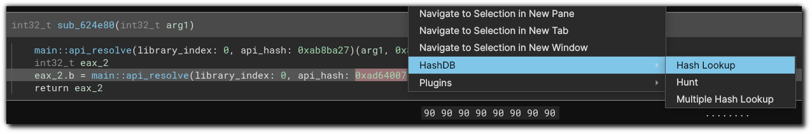
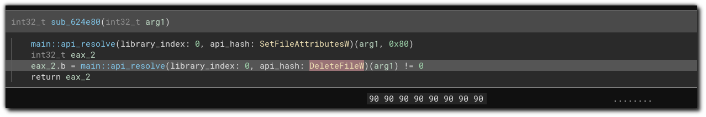
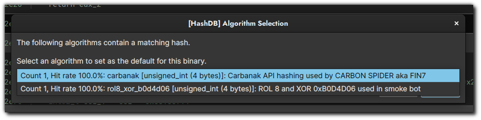
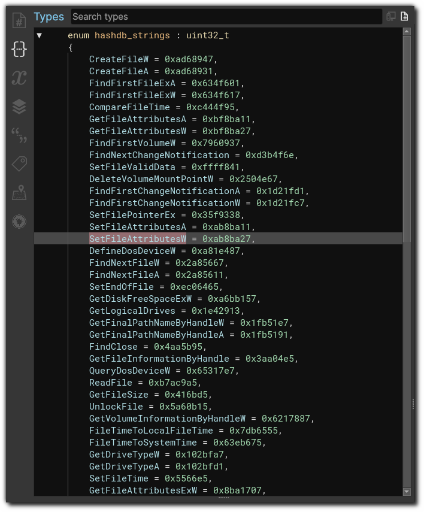
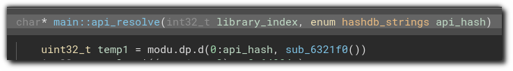
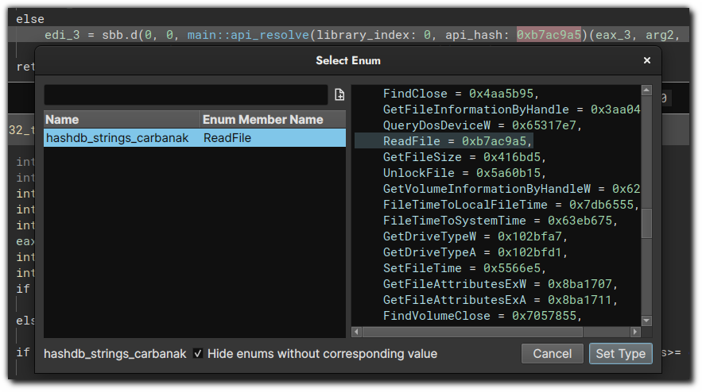
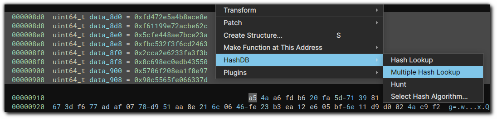
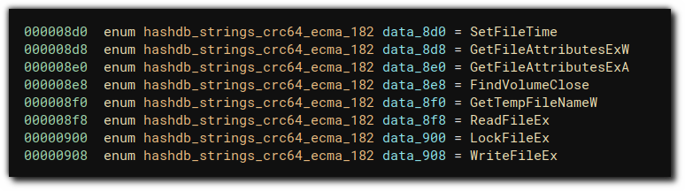
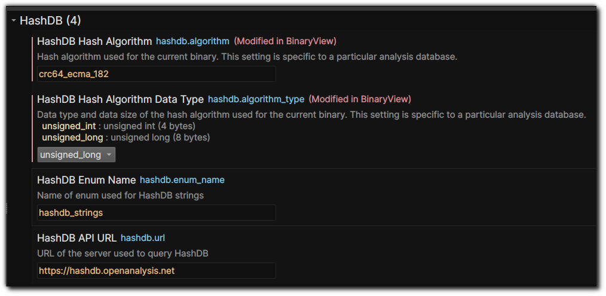

# #️⃣ Binary Ninja HashDB Plugin

[HashDB](https://github.com/OALabs/hashdb) is a community-sourced library of hashing algorithms used in malware. This plugin queries the [OALabs HashDB Lookup Service](https://hashdb.openanalysis.net/) for hash values which appear in the currently analyzed file, fetches a list of strings which match those hashes, and collects the string values into an enum type definition. The defined enum type can then be applied to the binary for further analysis.

## Usage

### Looking up a hash (_HashDB - Hash Lookup_)

The _HashDB - Hash Lookup_ command looks up the hash value highlighted by the cursor.

### Hunting for the correct hash algorithm (_HashDB - Hunt_)

The _HashDB - Hunt_ command attempts to identify the hash algorithm which was used to generate a particular hash value. The identified algorithm is set as the default algorithm for future hash lookups in this binary, in the _HashDB > HashDB Hash Algorithm_ setting.

It is the user's responsibility to ensure that the identified hash algorithm is correct! The list of all hash algorithms known to the OALabs HashDB lookup service is maintained at the [OALabs/hashdb repository, under the `algorithms` directory](https://github.com/OALabs/hashdb/tree/main/algorithms); a Python implementation of each hash algorithm is inside each listed file, and can be checked against the implementation of the API hashing function in the binary being analyzed.

### Viewing and applying found hashes

Found hashes are added as enum entries under a new enum type named `hashdb_strings_{NAME_OF_ALGORITHM}`. The names and values of the found hashes can be viewed in the _Types_ menu.

The enum type can then be applied to variables in the database.

If you are using Binary Ninja >= 3.3, you can also apply the resolved hash names using the new _Select Enum_ dialog (accessible by pressing the `M` key, or through _Display as_ > _Enum Member_ in the context menu).

The name prefix used in the enum type (by default `hashdb_strings`) can be changed in Binary Ninja's settings, under _HashDB > HashDB Enum Name_.

### Looking up multiple hashes (_HashDB - Multiple Hash Lookup_)

Multiple hashes can be selected and looked up at once using the _HashDB - Multiple Hash Lookup_ command.

The resolved hashes can then be applied by setting the selected variables to the created enum type.

### Settings

The settings for this plugin can be changed from Binary Ninja's Settings interface (_Edit > Preferences > Settings_). The settings list can be filtered to show only the HashDB plugin's settings by searching `HashDB` in the Settings search box.

The following settings are applied globally:

- _HashDB API URL_ (`hashdb.url`). If you wish to use a different HashDB instance than the default OALabs HashDB, such as an internally hosted version, you can change this setting to point at your desired instance.
- _HashDB Enum Name_ (`hashdb.enum_name`)

The following settings are specific to an individual binary. They are saved in the analysis database (`.bndb` file) for that binary, and will be restored the next time you open the analysis database.

- _HashDB Hash Algorithm_ (`hashdb.algorithm`)
- _HashDB Hash Algorithm Data Type_ (`hashdb.algorithm_type`)

### Keyboard shortcuts

Keyboard shortcuts can be set for this plugin's commands from Binary Ninja's Keybindings interface (_Edit > Preferences > Keybindings_). The command list can be filtered to show only the HashDB plugin's commands by searching `HashDB` in the Keybindings search box.

The plugin currently does not ship with any keyboard shortcuts set by default.

## Installation

This plugin can be installed via either:

1) Searching for the _HashDB_ plugin in Binary Ninja's built-in plugin manager (_Plugins > Manage Plugins_). _This is the recommended method._

2) Cloning this repository into your user plugins folder.
    - The [location of the user plugins folder will vary depending on the platform Binary Ninja is installed on](https://docs.binary.ninja/guide/index.html#user-folder). The easiest way to find the location of the folder is via the _Plugins > Open Plugin Folder..._ command.
    - If you are performing an installation via this method, you must also install this plugin's Python dependencies manually. This can be done by either:
        - Running the _Install python3 module..._ command (via the Command Palette), and pasting the contents of [`requirements.txt`](requirements.txt) in this repository into the dialog window.
        - Running `pip install -r requirements.txt` in the Python environment used by Binary Ninja.

This plugin requires Python >= 3.7, and Binary Ninja version >= 2.4.2846.

## License

This plugin is released under a 3-Clause BSD license.

This plugin is a derivative work of the [IDA Plugin](https://github.com/OALabs/hashdb-ida/) from [OALabs](https://oalabs.openanalysis.net/) for connecting to their [HashDB service](https://hashdb.openanalysis.net/), and is forked from Vector 35's initial implementation at [psifertex/hashdb-bn](https://github.com/psifertex/hashdb-bn).